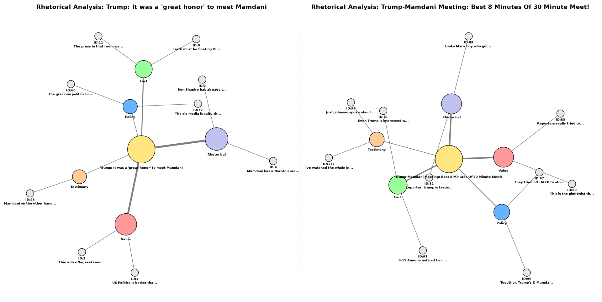

# YouTube Discourse Analysis: Rhetorical Classifier
*A hybrid NLP pipeline combining Active Learning (TF-IDF) and Deep Argument Mining (LLM).*

## 1. Methods

Analyzing discourse among online communities requires specialized Natural Language Processing, as the comments are highly emotive, adversarial and colloquial. Standard dense vector retrieval methods often fail on such short, noisy text due to vocabulary-match errors. This limitation is seen in this project's local baseline model (TF-IDF + Logistic Regression), as it tends to over-classify YouTube comments into a generic 'emotional' category.

To solve this, the rhetorical pipeline implements an LLM-based Argument Mining architecture. The framework consists of: 
- **Custom Social Media Taxonomy:** A 5-class system (Value, Policy, Testimony, Fact, Rhetorical) adapted from Abkenar et al. (2026) to effectively isolate emotional outbursts and accurately categorize value-laden opinions.
- **Checklist Scaffolding:** Instead of standard RAG pre-filtering, the system exposes the taxonomy directly via a merged prompt, forcing a systematic, step-by-step logical evaluation.
- **Adversarial Rule-Outs:** To prevent hallucination and biased predictions, the model is forced to quote exact  phrases and explicitly explain the logical mechanism behind rejecting alternative categories.


## 2. Project Architecture

Project consists of two different pipelines based on YouTube comments scraping and comments classification:

### Pipeline 1: Local Active Learning (Human-in-the-Loop)
- **Core Engine:** Scikit-learn (TF-IDF Vectorisation & Logistic Regression).
- **Objective:** A fast, lightweight baseline classification for comments' intent (substantive, emotional, off-topic).
- **Mechanism:** Operates on a continous learning loop. Comments are processed by the local ML model. Ambigous cases are flagged for LLM or even manual review. This intercention iteratively updates the local knowledge base ('YT_comments.xlsx') and retrains the model on the fly, ensuring constant adaptation to new slang or community-specific terms.

### Pipeline 2: Deep Rhetorical Comparison (LLM)
- **Core Engine:** Groq API (Qwen model) & NetworkX
- **Objective:** Deep Argument Mining to extract and contrast the rhetorical strategies used across two different YouTube comment sections.
- **Mechanism:** Bypasses traditional vectorization to evaluate complex statements using the 5-class social media taxonomy (Value, Policy, Testimony, Fact, Rhetorical)(Abkenar et al. 2026). The LLM returns precise classifications and extraction rationales in a strict JSON format.
- **Visualization:** Automatically constructs side-by-side relational network graphs (using NetworkX and Matplotlib) to visually map out how specific argumentative strategies cluster around each video.

## 3. Visualization of Argumentative Strategies
Comparative network graph mapping YouTube comments to a 5-class rhetorical taxonomy. Edge thickness indicates the density of a given argumentation strategy within the discourse.



## 4. Setup & How to Run

### Prerequisites
Make sure you have Python installed, along with valid API keys for:
- **YouTube Data API v3** ([Get a key via Google Cloud Console](https://console.cloud.google.com/))
- **Groq API** ([Generate a free key via GroqCloud](https://console.groq.com/keys))

### Installation
1. Clone the repository and navigate to the project directory.
2. Install the required dependencies:
    ``` bash
    pip install -r requirements.txt
    ```
3. Create a .env file in the root directory and add your API keys:
    ```bash
    YT_API_KEY=your_youtube_api_key_here
    GROQ_API_KEY=your_groq_api_key_here
    ```

### Execution
1. Running Pipeline 1 (Local Active Learning)
Navigate to the local folder and execute the interactive classification script:
    ``` bash
    python local_llm/local_lm_pipeline.py
    ```
2. Running Pipeline 2 (Deep Rhetorical Comparison):
Navigate to the comparison folder and run the end-to-end script. It will prompt you for two **YouTube video IDs** (the 11-character code after v= in a watch URL), classify the comments, save the dataset, and automatically render the comparative network graphs:
    ``` bash
    python yt_comments_classifier/comparison_pipeline.py
    ```
